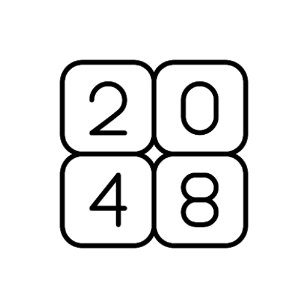

<p align="center">
  
</p>

<h1 align="center">2048</h1>

<p align="center">
  <strong>A modern 2048 puzzle game for Android — built with Kotlin & Jetpack Compose</strong>
</p>

<p align="center">
  <a href="https://github.com/0BL1V10N1/2048/releases"></a>
  <a href="https://github.com/0BL1V10N1/2048/actions/workflows/ci.yml"></a>
  <a href="LICENSE"></a>
  
  
</p>

# 🏗️ Built with

- [](https://kotlinlang.org/)
- [](https://developer.android.com/compose)
- [](https://m3.material.io/)

# 🚀 Getting started

- ## 📦 Prerequisites
    - 📱 **[Android Studio](https://developer.android.com/studio)**
    - ☕ **[JDK 17](https://adoptium.net/temurin/releases/)**
    - 🤖 **[Android SDK 36](https://developer.android.com/about/versions)**

- ## ⚙️ Installation
    - First **clone** the project

        ```bash
        git clone https://github.com/0BL1V10N1/2048.git
        cd 2048
        ```

    - Then **build and install** on your connected device !

        ```bash
        ./gradlew installDebug
        ```

- ## 🔧 Configuration
    - Modify the main game parameters in **[GameConstants.kt](app/src/main/java/dev/game2048/app/utils/GameConstants.kt)**:

        ```kotlin
        object GameConstants {
            const val GRID_SIZE = 4
            const val WIN_VALUE = 2048
            // ...
        }
        ```

# 💡 Features

- ### 🎮 Gameplay
    - Swipe to merge tiles and reach 2048
    - Play on **3×3**, **4×4**, **5×5**, or **6×6** grids
    - **Image Mode:** Replace tile numbers with custom images
    - **Undo System:** Up to **3 undos** per game

- ### 📳 Controls & UI
    - **Themes:** System (auto light/dark) and **Water** theme with unique color palettes
    - **Accelerometer Controls:** Tilt your device to move tiles
    - **Sound & Music:** Background music + merge sound effects

- ### 📊 Progression
    - **Game Timer:** Tracks your play time, pauses when the app is backgrounded
    - **Statistics:** Best score, top tile, games played, wins, losses, and **top 5 scores**
    - **Auto-Save:** Game state persisted with Room
    - **Share Score:** Capture and share your board as a screenshot

# 🤝 Contributing

1. **Fork** the repository
2. Create a feature branch (`git checkout -b feature/amazing-feature`)
3. Commit your changes (`git commit -m "feat: add amazing feature"`)
4. Push to the branch (`git push origin feature/amazing-feature`)
5. Open a **Pull Request**

# 👥 Contributors

<a href="https://github.com/0BL1V10N1/2048/graphs/contributors">
  
</a>